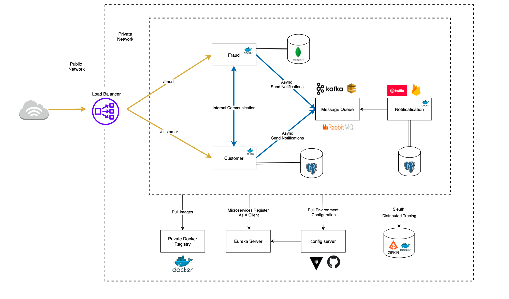

# microservice-spring-java

Learn how to develop microservices in Java using Spring

Microservice will be used for customer registration.

The architecture of our system will be:


Ref:

- https://www.youtube.com/watch?v=1aWhYEynZQw
- https://github.com/amigoscode/microservices

# Steps

#### Installing Maven

```
sudo apt update
sudo apt install maven
mvn --version
```

#### Create the project

```
mvn archetype:generate -DgroupId=com.example.app -DartifactId=microservice-spring-java -DarchetypeArtifactId=maven-archetype-quickstart -DarchetypeVersion=1.4 -DinteractiveMode=false
```